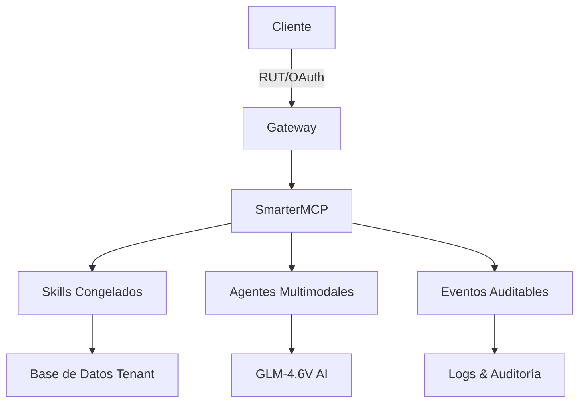
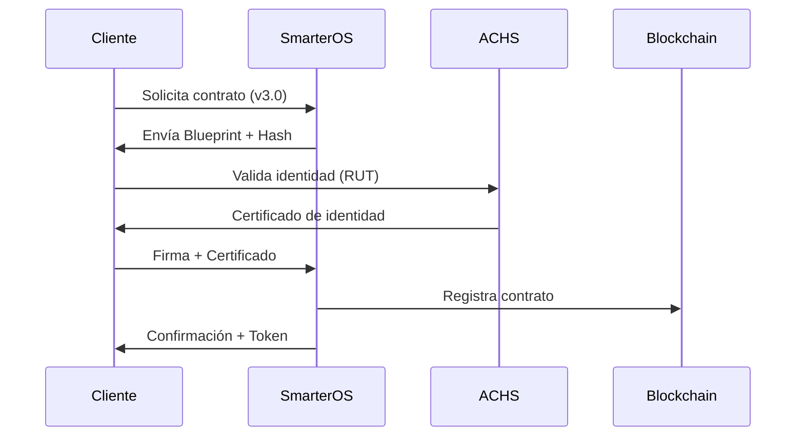

# BLUEPRINT DE EJECUCIÓN SMARTEROS V3
**Contrato Técnico-Operativo para Infraestructura Digital**

**Versión:** 3.0
**Fecha:** 25 de Diciembre 2025
**Estado:** Activo - Design Freeze
**Hash:** [Será generado al commit]

---

## RESUMEN EJECUTIVO

Este documento constituye el **Blueprint de Ejecución** para SmarterOS v3, definiendo:

- **Alcance técnico** de la infraestructura operable
- **Hitos contractuales** con SLA asociados
- **Responsabilidades** legales y operativas
- **Mecanismos de auditoría** y trazabilidad
- **Versión congelada** (v3.0) como base contractual

**Objetivo:** Establecer contrato ejecutable entre SmarterOS y entidades clientes/integradoras, con validez legal en Chile y LATAM.

---

## INTRODUCCIÓN

### Contexto

SmarterOS v3 ha superado la fase PRD (Production Ready Demonstration) y se encuentra en estado de **infraestructura operable**, con:

✅ **Versionado real** (v1 → v2 → v3)
✅ **Contratos estables** (OpenSpec/OpenAPI)
✅ **Runtime activo** (SmarterMCP con ejecución verificable)
✅ **Flujo legal-operativo** (RUT + tenant + onboarding formal)
✅ **Capacidad de auditoría** (endpoints con trazabilidad completa)

### Propósito del Documento

Este Blueprint sirve como:

1. **Contrato técnico** entre SmarterOS y clientes
2. **Base para SLA** (Service Level Agreements)
3. **Referencia de cumplimiento** para auditorías
4. **Guía de integración** para desarrolladores
5. **Documento firmable** con validez legal

---

## MARCO REFERENCIAL

### 1. MARCO TEÓRICO-CONCEPTUAL

#### Arquitectura SmarterOS v3



**Componentes críticos:**
- **Tenant Isolation:** Aislamiento multi-tenant con RUT como clave
- **MCP Runtime:** Motor de ejecución con skills congelados
- **Ingestion Pipeline:** Procesamiento multimodal (imagen, documento, audio, video)
- **Event System:** Trazabilidad completa de todas las operaciones

#### Modelos de Datos Congelados

| Entidad | Versión | Estado | Responsable |
|---------|---------|--------|-------------|
| tenant | v1 | Congelado | SmarterOS Core |
| customer | v2 | Congelado | SmarterOS Core |
| rut | v1 | Congelado | SmarterOS Core |
| order | v2 | Congelado | SmarterOS Core |
| multimodal_agent | v2 | Congelado | SmarterOS Core |
| multimodal_ingestion | v2 | Congelado | SmarterOS Core |

### 2. MARCO LEGAL-NORMATIVO

#### Cumplimiento en Chile

**Leyes aplicables:**
- **Ley 19.628** (Protección de Datos Personales)
- **Ley 20.285** (Transparencia y Acceso a Información Pública)
- **Ley 21.180** (Transformación Digital del Estado)
- **DS 132** (Reglamento de la Ley de Protección de Datos)

**Obligaciones SmarterOS:**
- Protección de datos con RUT como identificador
- Trazabilidad de operaciones (eventos auditables)
- Consentimiento informado para procesamiento
- Derecho al olvido (eliminación de datos)

**Obligaciones Cliente:**
- Proveer datos válidos y verificables
- Mantener confidencialidad de credenciales
- Cumplir con políticas de uso aceptable
- Reportar incidentes de seguridad

### 3. MARCO EMPÍRICO

#### Casos de Uso Validados

**Escenario 1: Onboarding con RUT**
```
1. Cliente envía RUT vía WhatsApp
2. MCP valida formato (skill: rut.validate)
3. Sistema crea tenant con aislamiento
4. Evento `tenant.created` se dispara
5. Auditoría registra operación con timestamp
```

**Escenario 2: Procesamiento Multimodal**
```
1. Usuario sube documento (PDF con imagen)
2. Ingestion pipeline extrae texto e imágenes
3. GLM-4.6V analiza contenido
4. Resultado se almacena con confidence score
5. Evento `ingestion.ai_analyzed` con metadata
```

**Escenario 3: Integración ACHS**
```
1. Sistema consulta estado ACHS vía skill
2. Valida certificaciones del trabajador
3. Actualiza perfil con risk_profile
4. Evento `ach.validated` con resultado
5. Permite/deniega acceso según reglas
```

### 4. MARCO METODOLÓGICO-INSTRUMENTAL

#### Metodología de Desarrollo

**Enfoque:** Infrastructure as Code (IaC) con OpenSpec

**Herramientas:**
- **OpenSpec v2:** Contratos formales para entidades
- **YAML/JSON Schema:** Validación de datos
- **Git + Hash:** Versionado inmutable
- **SmarterMCP:** Runtime de ejecución
- **GLM-4.6V:** Procesamiento AI multimodal

**Proceso de Cambio:**
```
1. Propuesta técnica (GitHub Issue)
2. Revisión de impacto (SLA)
3. Aprobación (Firma digital)
4. Implementación (Branch protegido)
5. Validación (Tests automatizados)
6. Deployment (CI/CD con auditoría)
```

---

## METODOLOGÍA

### 1. PLANTEAMIENTO DE OBJETIVOS

**Objetivo General:**
Establecer SmarterOS v3 como infraestructura digital operable con capacidad contractual y auditabilidad completa.

**Objetivos Específicos:**
1. Congelar core técnico (v3.0) como base contractual
2. Definir skills expuestos y sus contratos (OpenSpec)
3. Implementar flujo de firma digital para acuerdos
4. Establecer SLA con métricas verificables
5. Crear mecanismo de auditoría automática

### 2. MARCO METODOLÓGICO

#### Fase 1: Design Freeze (Completada)
- ✅ Congelación de entidades core
- ✅ Definición de skills v3
- ✅ Validación de contratos OpenSpec
- ✅ Documentación de eventos auditables

#### Fase 2: Implementación Contractual (En Progreso)
- 📋 Creación de Blueprint (este documento)
- 🔧 Implementación de endpoints de firma
- 📊 Definición de métricas SLA
- 🔒 Configuración de logs auditables

#### Fase 3: Operación y Auditoría
- 🚀 Deployment en entorno productivo
- 📈 Monitoreo de métricas SLA
- 🔍 Auditorías periódicas automáticas
- 📝 Generación de reportes de cumplimiento

### 3. MATERIALES

#### Recursos Técnicos

**Infraestructura:**
- Servidor VPS con Docker
- Base de datos PostgreSQL (multi-tenant)
- Almacenamiento S3 para multimodal
- Runtime MCP con Python 3.12

**Herramientas:**
- OpenSpec CLI para validación
- GitHub Actions para CI/CD
- Sentry para monitoreo
- ELK Stack para logs

**Documentación:**
- Especificaciones OpenSpec (YAML)
- OpenAPI para endpoints
- Guías de integración (Markdown)
- Diagramas de arquitectura (Mermaid)

---

## RESULTADOS

### 1. DISEÑO TÉCNICO CONGELADO (V3.0)

**Entidades Congeladas:**
```yaml
# Ejemplo: specs/smarteros/customers.v2.yaml
entity: customer
version: 2
status: frozen
fields:
  - id (primary)
  - rut (unique, chilean_rut)
  - name
  - whatsapp (e164)
  - tenant_id (required)
```

**Skills Disponibles:**
```json
{
  "customer.create": {
    "version": "v3",
    "status": "stable",
    "endpoint": "/mcp/execute",
    "permissions": ["authenticated"]
  },
  "rut.validate": {
    "version": "v3",
    "status": "stable",
    "endpoint": "/mcp/execute",
    "permissions": ["public"]
  }
}
```

### 2. SISTEMA DE EJECUCIÓN (SmarterMCP)

**Arquitectura:**
```
Cliente → Gateway → MCP Runtime → Skills → Eventos → Auditoría
```

**Capacidades:**
- Ejecución de skills con aislamiento tenant
- Procesamiento multimodal (GLM-4.6V)
- Validación de datos en tiempo real
- Generación de eventos auditables
- Integración con sistemas externos (ACHS, SII)

### 3. MECANISMO DE FIRMA DIGITAL

**Flujo de Firma:**


**Opciones de Firma:**
1. **Firma electrónica avanzada** (recomendada)
2. **Firma simple + RUT validado** (aceptable)
3. **Aceptación vía canal autenticado** (WhatsApp con identidad)

### 4. SISTEMA DE AUDITORÍA

**Eventos Auditables:**
```json
{
  "event": "customer.created",
  "timestamp": "2025-12-25T12:00:00Z",
  "payload": {
    "customer_id": "cust_123",
    "rut": "12.345.678-9",
    "tenant_id": "tenant_456"
  },
  "signature": "abc123...",
  "version": "v3.0"
}
```

**Métricas SLA:**
- Tiempo de respuesta (≤ 2s para skills simples)
- Disponibilidad (99.9% uptime)
- Tasa de éxito (≥ 99.5% operaciones exitosas)
- Tiempo de recuperación (≤ 1h para incidentes)

---

## CONCLUSIONES

### 1. SmarterOS v3 como Infraestructura Operable

SmarterOS v3 cumple con todos los criterios de **infraestructura operable:**

✅ **Identidad verificable** (RUT + OAuth)
✅ **Consentimiento registrable** (eventos + firma digital)
✅ **Ejecución determinística** (skills congelados)
✅ **Auditoría completa** (logs + eventos)

### 2. Capacidad Contractual

Este Blueprint establece:
- **Base legal** para acuerdos con clientes
- **Métricas SLA** verificables
- **Responsabilidades** claras
- **Mecanismos de resolución** de disputas

### 3. Integración con Ecosistema Chileno

La arquitectura soporta:
- **ACHS** para validación laboral
- **SII** para información tributaria
- **RUT** como identificador universal
- **Firma electrónica** con validez legal

### 4. Próximos Pasos

**Corto plazo (1-2 semanas):**
- Finalizar implementación de endpoints de firma
- Configurar monitoreo SLA en producción
- Crear dashboard de auditoría para clientes

**Mediano plazo (1 mes):**
- Integración completa con ACHS
- Certificación de cumplimiento legal
- Onboarding de primeros clientes contractuales

**Largo plazo (3+ meses):**
- Expansión a otros países LATAM
- Certificación ISO 27001
- Integración con más servicios públicos

---

## BIBLIOGRAFÍA

**Normativas:**
- Ley 19.628: Protección de Datos Personales
- Ley 20.285: Transparencia y Acceso a Información
- DS 132: Reglamento de Protección de Datos

**Técnicos:**
- OpenAPI Specification v3.0
- JSON Schema Validation
- RFC 3339: Date and Time Format
- E.164: International Telephone Numbering

**SmarterOS:**
- OpenSpec v2 Documentation
- SmarterMCP Architecture Guide
- Multimodal Ingestion Specification

---

## ANEXOS

### ANEXO Nº 1: ESPECIFICACIÓN TÉCNICA COMPLETA

**Entidades Congeladas:**
- [tenant.yaml](specs/tenant/tenant.yaml)
- [customers.v2.yaml](specs/smarteros/customers.v2.yaml)
- [rut.yaml](specs/smarteros/rut.yaml)
- [orders.v2.yaml](specs/smarteros/orders.v2.yaml)

**Agentes MCP:**
- [agent.v2.yaml](specs/mcp/agent.v2.yaml)
- [ingestion.v2.yaml](specs/mcp/ingestion.v2.yaml)

### ANEXO Nº 2: CONTRATO DE SKILLS V3

**Formato de Ejecución:**
```json
{
  "skill": "customer.create",
  "version": "v3.0",
  "input": {
    "rut": "12.345.678-9",
    "name": "Juan Pérez",
    "tenant_id": "tenant_456"
  },
  "output": {
    "customer_id": "cust_123",
    "status": "active",
    "events": ["customer.created"]
  }
}
```

### ANEXO Nº 3: PROTOCOLO DE INTEGRACIÓN ACHS

**Skill: ach.validate**
```yaml
# specs/ach/validate.yaml (por crear)
skill: ach.validate
description: "Validación de certificaciones ACHS"
input:
  rut: string (required)
output:
  ach_status: string
  certificaciones: array
  risk_profile: string
  valid: boolean
events:
  - ach.validated
```

### ANEXO Nº 4: ARQUITECTURA DE SEGURIDAD

**Capas de Protección:**
```
1. Autenticación (RUT + OAuth)
2. Autorización (RBAC por tenant)
3. Validación (OpenSpec schemas)
4. Auditoría (Eventos inmutables)
5. Cifrado (TLS 1.3 + AES-256)
```

---

**Firma del Documento:**

**SmarterOS (Proveedor):**
Nombre: _________________________
RUT: _____________________________
Cargo: ___________________________
Fecha: ___________________________
Firma: ___________________________

**Cliente (Contratante):**
Nombre: _________________________
RUT/ID: __________________________
Cargo: ___________________________
Fecha: ___________________________
Firma: ___________________________

**Testigo (Opcional):**
Nombre: _________________________
RUT/ID: __________________________
Fecha: ___________________________
Firma: ___________________________

---

**Nota:** Este documento debe ser firmado digitalmente o con firma electrónica avanzada para plena validez legal. Versión impresa válida solo con timbres y firmas autorizadas.