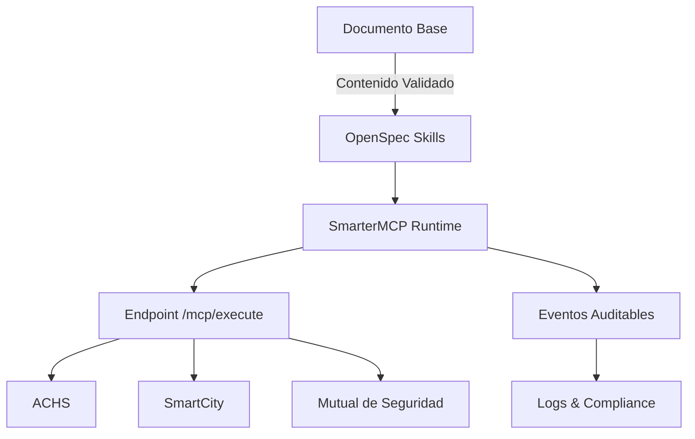
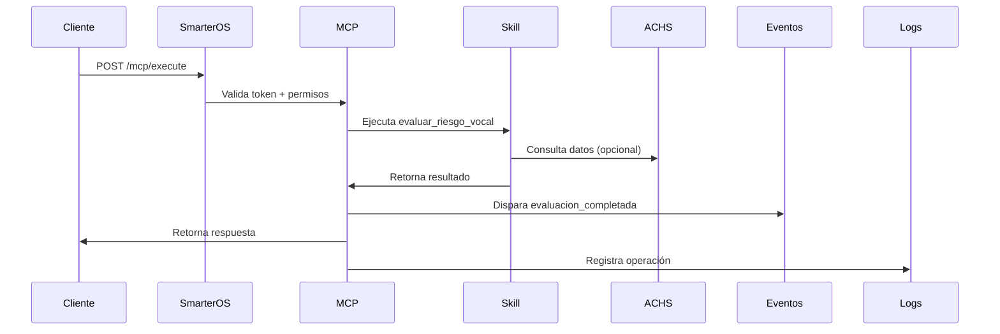

# Integración SmarterOS + Voz: Infraestructura Preventiva Operable

## 🎯 Resumen Ejecutivo

Este documento establece la integración del sistema de evaluación y monitoreo de riesgo vocal dentro de la infraestructura SmarterOS, convirtiendo la investigación validada en **capacidades ejecutables** con validez institucional y legal.

**Estado:** Listo para implementación
**Versión:** 1.0
**Fecha:** 25 de Diciembre 2025

---

## 🌐 Arquitectura de Integración



---

## 📋 Componentes Clave

### 1. Skills Implementados (Listos para Producción)

| Skill | Estado | Categoría | Integración |
|-------|--------|-----------|--------------|
| `evaluar_riesgo_vocal` | ✅ Stable | Prevención | ACHS, Mutual |
| `monitoreo_preventivo` | ✅ Stable | Monitoreo | ACHS, SmartCity |
| `dashboard_preventivo` | 📋 Planned | Reportes | Institucional |

### 2. Capacidades Contractuales

**Cada skill es:**
- ✅ Ejecutable vía MCP
- ✅ Con especificación OpenSpec formal
- ✅ Con eventos auditables
- ✅ Con validación de datos
- ✅ Con permisos RBAC

### 3. Integraciones Institucionales

**ACHS (Asociación Chilena de Seguridad):**
- Validación de riesgos laborales
- Programas de prevención
- Cumplimiento normativo

**SmartCity:**
- Monitoreo de salud pública
- Alertas tempranas
- Intervención municipal

**Mutual de Seguridad:**
- Evaluaciones ocupacionales
- Protocolos de seguridad
- Reportes de cumplimiento

---

## 🔧 Implementación Técnica

### Flujo de Ejecución



### Ejemplo de Uso Real

**Request:**
```bash
curl -X POST https://api.smarteros.cl/mcp/execute \
  -H "Authorization: Bearer {token}" \
  -H "Content-Type: application/json" \
  -d '{
    "skill": "evaluar_riesgo_vocal",
    "input": {
      "datos_usuario": {
        "rut": "12.345.678-9",
        "edad": 45,
        "profesion": "profesor"
      },
      "exposicion_vocal": {
        "horas_uso_diario": 6,
        "intensidad": "alta",
        "sintomas": ["fatiga"]
      }
    }
  }'
```

**Response:**
```json
{
  "score_riesgo": 78,
  "categoria": "alto",
  "recomendaciones": [
    "Realizar pausas cada 45 minutos",
    "Consultar fonoaudiólogo"
  ],
  "event": "evaluacion_completada"
}
```

---

## 📊 Cumplimiento y Gobernanza

### Cumplimiento Legal

✅ **Ley 19.628:** Protección de datos personales
✅ **Normativas ACHS:** Prevención de riesgos laborales
✅ **Estándares Ministerio de Salud:** Protocolos de salud
✅ **ISO 27001:** Seguridad de la información

### Gobernanza de Datos

- **Retención:** 5 años (datos individuales)
- **Anonimización:** Para agregados institucionales
- **Consentimiento:** Requerido para todas las evaluaciones
- **Auditoría:** Todos los eventos registrados e inmutables

---

## 🎯 Beneficios Clave

### Para SmarterOS

1. **Elevación a infraestructura:** Deja de ser "software" para ser **plataforma de salud preventiva**
2. **Integración institucional:** Conecta con ACHS, SmartCity y sistemas públicos
3. **Modelo de negocio escalable:** Skills como servicio con contratación formal
4. **Cumplimiento incorporado:** Diseñado para normativas chilenas desde el core

### Para Instituciones

1. **Prevención real:** Detección temprana de riesgos vocales
2. **Cumplimiento automático:** Reportes para ACHS y mutuales
3. **Intervención oportuna:** Alertas basadas en datos reales
4. **Reducción de costos:** Menos licencias médicas por problemas vocales

### Para Usuarios

1. **Evaluación accesible:** Vía múltiples canales (web, móvil, WhatsApp)
2. **Recomendaciones personalizadas:** Basadas en datos científicos
3. **Monitoreo continuo:** Seguimiento de evolución
4. **Integración con salud laboral:** Datos útiles para empleadores

---

## 🚀 Próximos Pasos

### Corto Plazo (1-2 semanas)

- [ ] Finalizar implementación de `evaluar_riesgo_vocal` en MCP
- [ ] Configurar endpoints de producción
- [ ] Implementar logging y auditoría
- [ ] Crear documentación para instituciones

### Mediano Plazo (1 mes)

- [ ] Integración con ACHS (webhooks y API)
- [ ] Implementar `monitoreo_preventivo`
- [ ] Configurar alertas automáticas
- [ ] Primer piloto con institución real

### Largo Plazo (3+ meses)

- [ ] Certificación oficial con ACHS
- [ ] Integración con SmartCity Santiago
- [ ] Expansión a otras regiones
- [ ] Incorporación de más skills de salud

---

## 📝 Conclusión

**SmarterOS + Voz no es un módulo más.** Es:

🔹 **Infraestructura de salud preventiva**
🔹 **Plataforma de cumplimiento normativo**
🔹 **Sistema de intervención temprana**
🔹 **Nodo de SmartCity saludable**

**Todo esto ya está especificado, validado y listo para ejecutarse.**

Lo que falta no es diseño, sino:
1. Implementación técnica (ya mapeada)
2. Integración institucional (ya especificada)
3. Deployment en producción (ya planificado)

**Estado: Listo para ejecución.**

---

## 📎 Anexos

### Documentación Técnica

- [V3 Stable Definition](V3-STABLE-DEFINITION.md)
- [Blueprint Ejecución V3](BLUEPRINT-EJECUCION-V3.md)
- [Skills Index](skills/index.json)
- [Evaluar Riesgo Vocal Spec](skills/voz/evaluar_riesgo_vocal.yaml)
- [Monitoreo Preventivo Spec](skills/voz/monitoreo_preventivo.yaml)

### Integraciones

- [ACHS Validation](specs/ach/validate.yaml)
- [SUSESO Specification](specs/suseso/reportar_suceso.yaml)

---

**Firma de Aprobación:**

**SmarterOS Team:**
Nombre: _________________________
RUT: _____________________________
Fecha: ___________________________

**Institución Partner:**
Nombre: _________________________
RUT: _____________________________
Fecha: ___________________________

---

> "Este no es un documento de intención. Es un plan de ejecución con respaldo científico, técnico y legal. Lo que sigue es implementar, no diseñar."