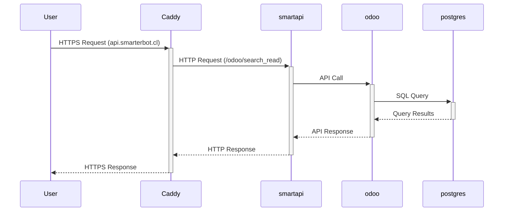

# SmarterOS Technical Architecture Documentation

## 1. High-Level System Design

### Overview

SmarterOS is a highly modular, containerized operating system designed for business automation, leveraging a diverse set of services including web servers, databases, AI integration, and automation tools. It is built with a focus on scalability, security, and extensibility, facilitating seamless interaction between different services to automate complex business workflows.

## 2. Container Architecture

### Container Inventory

SmarterOS employs Docker containers to encapsulate its services, ensuring isolation, easy deployment, and scalability. The container ecosystem includes:

- **API Services** (FastAPI, Odoo, n8n, Chatwoot, etc.) for business logic and automation.
- **Data Persistence** (PostgreSQL, Redis, Supabase) for database services and caching.
- **Networking** (Caddy) for reverse proxy and SSL termination.
- **Secret Management** (Vault, planned) for secure storage and management of secrets.

### Development vs. Production

Development containers such as `smarterbolt-lab` are used for internal development and testing, separated from production services to prevent interference and ensure stability.

## 3. Network Topology

### Internal Networking

Docker's internal networking capabilities are leveraged to facilitate communication between containers. Services like `smartapi`, `odoo`, and `n8n` are configured to communicate over this internal network, isolated from external access for security.

### External Access

Caddy acts as the entry point for all external traffic, routing requests to the appropriate service container based on the hostname. This setup simplifies SSL management and provides a single point of configuration for access control.

## 4. Data Flow Diagrams

### Example: Unified API Request Handling

This diagram illustrates how a user request flows through the system to retrieve data from the Odoo ERP system, highlighting the role of each component in the process.

## 5. Security Model

### SSL/TLS

All external communication is secured using SSL/TLS, with certificates managed by Caddy, which automates certificate issuance and renewal through Let's Encrypt.

### Secret Management

Environment variables and `.env.production` files are currently used for secret management, with a plan to migrate to HashiCorp Vault for enhanced security, enabling dynamic secret injection and centralized management.

### Container Isolation

Containers are used to isolate services and limit the attack surface. Each service runs with the minimum required permissions, reducing the risk of privilege escalation.

### Network Security

Internal network traffic between containers is isolated from external access. Firewall rules and network segmentation further enhance security by controlling traffic flow and limiting direct access to sensitive components.

## 6. Scalability Considerations

### Stateless Design

API and web services are designed to be stateless where possible, allowing for easy horizontal scaling by adding more container instances behind a load balancer.

### Database Scalability

PostgreSQL and Redis are configured for scalability, with options for replication and clustering to handle increased load. Supabase provides a scalable backend-as-a-service for further expansion.

### Load Balancing

Caddy acts as a reverse proxy and load balancer, distributing incoming traffic across multiple instances of services to ensure high availability and load distribution.

## 7. Technology Stack Justification

### Docker

Docker provides a lightweight, efficient means of containerization, enabling SmarterOS to package and deploy services consistently across different environments.

### Caddy

Chosen for its simplicity in configuration, automatic SSL, and performance as a reverse proxy. It simplifies the routing of requests to the appropriate containers and manages SSL certificates seamlessly.

### FastAPI & Uvicorn

FastAPI offers a high-performance, easy-to-use framework for building APIs, with automatic Swagger documentation. Uvicorn, an ASGI server, is used for its lightning-fast performance in serving ASGI applications.

### PostgreSQL & Redis

PostgreSQL is selected for its reliability and feature set for complex queries and data integrity. Redis serves as a high-performance key-value store for caching and session management, reducing load on the primary database.

### Supabase

Provides a scalable, managed backend service that complements PostgreSQL with additional features like real-time subscriptions and authentication, simplifying development and scalability.

### Odoo & n8n

Odoo offers a comprehensive suite of business applications, making it a versatile choice for ERP/CRM needs. n8n is selected for workflow automation, with a wide range of integrations and a visual workflow editor.

### Security: Vault (Planned)

The migration to Vault for secret management is planned to enhance security by centralizing and securing the storage and access of secrets, leveraging its dynamic secrets and fine-grained access control.

### Observability: Grafana, Prometheus, Loki, & Jaeger (Planned)

This stack is chosen for comprehensive observability, enabling monitoring (Prometheus), log aggregation (Loki), visualization (Grafana), and tracing (Jaeger) to ensure system performance and reliability.

---

This architecture documentation encapsulates the design considerations, component interactions, and strategic choices made in the development of SmarterOS, providing a foundation for ongoing development, scalability, and security enhancements.