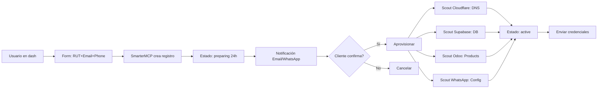

# SmarterOS - Actualización OpenSpec
**Fecha:** 2025-12-09 00:30 UTC  
**Versión:** V3 Roadmap

---

## 🏗️ ARQUITECTURA ACTUALIZADA

### Stack Tecnológico Core

```yaml
ERP: Odoo 17 (→ 19 en Enero)
CRM: Chatwoot (WhatsApp Meta autorizado)
Automation: N8N 2.0.0-rc.4
Database: Supabase (PostgreSQL + Auth + Storage)
Orquestador: SmarterMCP (nuevo)
API Framework: FastAPI
Reverse Proxy: Caddy
CDN/SSL: Cloudflare
Deploy: Dokploy + Docker
```

### Scouts AI

```yaml
Qwen (Local VPS):
  tipo: LLM local
  función: NLP + Code generation
  ventaja: Sin costo API, privacidad
  
OpenRouter (Cloud):
  modelos_disponibles:
    - gpt-4o-mini: Ligero, rápido, $0.15/1M tokens
    - claude-3-haiku: Económico, $0.25/1M tokens
    - llama-3.1-70b: Open source, $0.35/1M tokens
  
  criterio_selección:
    - Carga VPS < 70% → Qwen local
    - Carga VPS > 70% → OpenRouter cloud
    - Tareas críticas → Claude
    - Tareas rápidas → GPT-4o-mini
    
FastAPI:
  función: REST endpoints rápidos
  uso: Interfaces para scouts y MCP tools
```

### MCP Tools Registry

```yaml
Integrados:
  - @modelcontextprotocol/server-github
  - @cloudflare/mcp-server-cloudflare
  - @supabase/mcp-server (custom)
  - @vercel/mcp-deploy (custom)
  
Planificados:
  - @google/mcp-gmail (Q1 2026)
  - @meta/mcp-ads (Q1 2026)
  - @mercadolibre/mcp-api (Q2 2026)
  
Repositorios:
  ubicación: github.com/smarteros-os/mcp-*
  gestión: SmarterMCP auto-deploy
  versionado: Semantic versioning
```

---

## 🌐 ARQUITECTURA DE DOMINIOS

### Estrategia Dual

```yaml
.CL (smarterbot.cl):
  target: LATAM B2B
  enfoque: Personalización + soporte humano
  entrada: Manual + educativa
  conversión: Email + llamada + demo
  pricing: Orientativo, negociable
  
.STORE (smarterbot.store):
  target: Global SMB/B2C
  enfoque: Self-service + automatización
  entrada: Automática 24x7
  conversión: Checkout + WhatsApp bot
  pricing: Fijo, pago inmediato
```

### Subdominios Productivos

```yaml
# LATAM (.cl)
smarterbot.cl:         Landing + Marketing (Vercel)
odoo.smarterbot.cl:    ERP Odoo Frontend (VPS)
flow.smarterbot.cl:    Onboarding manual (VPS)
crm.smarterbot.cl:     Chatwoot CRM (VPS)

# GLOBAL (.store)
smarterbot.store:      Tienda automatizada (VPS)
flow.smarterbot.store: Onboarding unificado (VPS)
dash.smarterbot.store: Alta de clientes (SmarterMCP)
n8n.smarterbot.store:  Automation workflows (VPS)
```

---

## 🤖 SMARTERMCP - ORQUESTADOR

### Concepto

SmarterMCP es el "Gerente AI" que:
1. Recibe solicitudes de alta desde dash.smarterbot.store
2. Prepara infraestructura (período de 24h)
3. Consulta al cliente vía email/WhatsApp
4. Aprovisiona al confirmar:
   - Database Supabase
   - DNS Cloudflare
   - Products Odoo
   - WhatsApp config
   - Deploy Dokploy

### API Endpoints

```typescript
GET  /health                    // Health check
GET  /api/tenants               // Listar tenants
POST /api/tenants               // Crear tenant (24h hold)
POST /api/tenants/:id/provision // Aprovisionar
GET  /api/tenants/:id/status    // Estado
```

### Workflow Automatizado



---

## 📊 COMPONENTES DETALLADOS

### Supabase

```yaml
Uso actual:
  - Auth: OAuth providers (Google, GitHub)
  - Database: Tenants + users + products
  - Storage: Archivos de usuarios
  - Realtime: Notificaciones
  
Free Tier:
  database: 500 MB
  bandwidth: 2 GB/mes
  auth_users: 50,000 MAU
  storage: 1 GB
  realtime_connections: 200
  
Escalado estimado:
  Q1_2026: ~50 tenants → Free tier OK
  Q2_2026: ~200 tenants → Necesita Pro ($25/mes)
```

### N8N Workflows

```yaml
Workflows activos:
  1. tenant-onboarding:
     trigger: Webhook desde dash
     acciones: 
       - Crear en Supabase
       - Notificar WhatsApp
       - Crear Odoo products
       - Configurar DNS
     
  2. whatsapp-bot:
     trigger: Mensaje WhatsApp
     acciones:
       - Procesar con Qwen
       - Buscar en Odoo
       - Responder automático
     
  3. email-campaigns:
     trigger: Scheduled
     acciones:
       - Segmentar en Supabase
       - Enviar via Mailgun
       - Track opens/clicks
```

### Odoo 17 → 19

```yaml
Migración planificada:
  fecha: Diciembre 20-25, 2025
  método: Nueva instancia paralela
  backup: Completo pre-migración
  testing: 3 días en staging
  downtime: < 2 horas
  
Nuevas features Odoo 19:
  - Mejor UI/UX
  - Performance mejorado
  - Studio más potente
  - Mejor integración API
```

---

## 🔐 SEGURIDAD Y COMPLIANCE

### SSL/TLS

```yaml
Cloudflare:
  modo: Full (strict)
  certificados: Origin + Edge
  HSTS: Habilitado
  TLS: 1.2+ (1.3 preferido)
  
Caddy:
  auto_https: Enabled
  issuer: Let's Encrypt
  ALPN: h2, http/1.1
```

### Autenticación

```yaml
Usuarios finales:
  método: Clerk (OAuth)
  providers: Google, GitHub, Email
  
Admin/Staff:
  método: Supabase Auth
  MFA: Habilitado
  roles: admin, staff, viewer
```

### Data Privacy

```yaml
GDPR: Compliant
Ley_19628_CL: Compliant (ver /root/LEY-19628-COMPLIANCE.md)
Backups: Diarios automáticos
Encriptación: At rest + in transit
```

---

## 💰 MODELO DE NEGOCIO

### Pricing Tiers

```yaml
FREE (.cl - flow):
  precio: $0
  incluye:
    - Acceso con código
    - 1 usuario
    - Storage 100 MB
    - WhatsApp bot básico
  límite: Testing/demos
  
BASIC (.store):
  precio: $29/mes
  incluye:
    - 3 usuarios
    - Storage 1 GB
    - WhatsApp bot full
    - N8N workflows (10)
    - Odoo básico
    
PRO (.store):
  precio: $99/mes
  incluye:
    - 10 usuarios
    - Storage 10 GB
    - WhatsApp + SMS
    - N8N ilimitado
    - Odoo completo
    - Soporte prioritario
    
ENTERPRISE (.cl):
  precio: Personalizado
  incluye:
    - Todo PRO +
    - Customización
    - Soporte 24x7
    - On-premise option
    - SLA garantizado
```

### Proyección Ingresos

```yaml
Q4_2025 (Dic):
  tenants: 5 (testing)
  MRR: $0 (beta)
  
Q1_2026 (Ene-Mar):
  tenants: 30-50
  MRR: $1,500 - $2,500
  costos: ~$300/mes
  margen: 80%+
  
Q2_2026 (Abr-Jun):
  tenants: 100-200
  MRR: $5,000 - $10,000
  costos: ~$800/mes
  margen: 85%+
```

---

## 🚀 ROADMAP

### Diciembre 2025 (V2.5)

```yaml
Semana 1 (9-15):
  - [x] DNS fix 522 error
  - [ ] Deploy SmarterMCP
  - [ ] Crear dash.smarterbot.store
  - [ ] Google OAuth en flow
  - [ ] Primera venta cerrada
  
Semana 2 (16-22):
  - [ ] Visual update odoo.smarterbot.cl
  - [ ] SMS integration (evaluar)
  - [ ] Scouts Qwen + OpenRouter
  - [ ] N8N workflows refinados
  
Semana 3-4 (23-31):
  - [ ] Odoo 17 → 19 upgrade
  - [ ] MCP Registry completo
  - [ ] Bolt 2026 (Gerente AI)
  - [ ] Testing end-to-end completo
```

### Enero 2026 (V3.0)

```yaml
Features principales:
  ✅ WhatsApp Meta API v3
  ✅ SmarterMCP orquestando
  ✅ Onboarding 100% auto
  ✅ Odoo 19 operativo
  ✅ Scouts ejecutando MCPs auto
  ✅ Cloudflare SaaS (custom hostnames)
  
Objetivo comercial:
  - 10 clientes pagos
  - $500 MRR mínimo
  - Colaborador Ohio activo
  - Colaborador Adnan (APK) activo
```

---

## 📝 DOCUMENTACIÓN TÉCNICA

### Para Desarrolladores

```bash
# Clonar repos
git clone https://github.com/smarteros-os/smarteros-os
git clone https://github.com/smarteros-os/smarteros-specs

# Setup local
cd smarteros-os
./scripts/setup-dev.sh

# Deploy SmarterMCP
./deploy-smartermcp.sh

# CLI management
./smartermcp-cli.sh health
./smartermcp-cli.sh create cliente@ejemplo.cl +56912345678 "Demo"
```

### Para Ventas/Marketing

```markdown
Propuesta de valor:
- Setup en 24 horas
- WhatsApp automatizado
- ERP + CRM integrado
- Sin contratos largos
- Precio transparente

Diferenciadores:
- Único con Odoo + Chatwoot + N8N integrado
- WhatsApp oficial Meta
- Automatización real (no manual disfrazado)
- Open source base (no vendor lock-in)
```

---

## 🎯 MÉTRICAS CLAVE (KPIs)

```yaml
Operacionales:
  - Uptime: > 99.5%
  - Response time API: < 200ms
  - Deploy time: < 24h
  
Comerciales:
  - CAC (Cost Acquisition): < $50
  - LTV (Lifetime Value): > $500
  - Churn: < 10%/mes
  - NPS: > 50
  
Técnicos:
  - Docker containers: ~25 activos
  - DB size: < 10 GB
  - Bandwidth: < 500 GB/mes
  - CPU usage: < 60% avg
```

---

## 📞 CONTACTOS Y COLABORADORES

```yaml
Equipo actual:
  - Backend: Desarrollo interno
  - Marketing: Colaborador Ohio (US)
  - APK/Móvil: Adnan (en negociación)
  - Idiomas: ES + EN

Necesidades:
  - Frontend specialist (React/Next.js)
  - DevOps (Kubernetes future)
  - Sales (LATAM territory)
```

---

**Actualizado:** 2025-12-09 00:30 UTC  
**Próxima revisión:** 2025-12-16 (post deploy dash)
